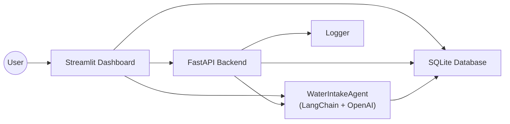

# 💧 AI Water Intake Tracker


An AI-powered hydration tracking app built with **Streamlit**, **FastAPI**, and **LangChain + OpenAI**.  
It helps users track daily water intake, habits, and mood while generating smart AI reflections.

This project demonstrates full-stack AI app engineering with UI, API, database persistence, and an LLM agent.

---
## 🚀 Features

- 💧 Daily hydration tracking
- 🎯 Goal setting & reminders
- 📊 Intake analytics dashboard
- 😊 Mood & habit journaling
- 🤖 AI-generated reflections
- 📁 CSV import/export
- ⚡ FastAPI integration endpoints
- 💾 SQLite persistent storage
- 🧠 LangChain + OpenAI agent

---

## 🧠 Architecture



---

## 🧩 Project Structure

```
water-intake-tracker/
│
├── dashboard.py
├── requirements.txt
├── .env
│
├── src/
│   ├── agent.py
│   ├── database.py
│   ├── api.py
│   └── logger.py
│
├── assets/
│   └── demo.gif
│
└── water_tracker.db
```

---

## 🛠 Technology Stack

- Python 3.10+
- Streamlit
- FastAPI + Uvicorn
- LangChain
- OpenAI API
- SQLite
- pandas
- python-dotenv

---

## ⚙️ Installation

### Clone repository

```bash
git clone https://github.com/Meet-Amin/water-intake-tracker.git
cd water-intake-tracker
```

### Create virtual environment

```bash
python -m venv .venv
source .venv/bin/activate
```

### Install dependencies

```bash
pip install -r requirements.txt
```

---

## 🔐 Environment Setup

Create `.env` file:

```
OPENAI_API_KEY=your_openai_key_here
DATABASE_URL=sqlite:///water_tracker.db
```

---

## ▶️ Running the App

Start dashboard:

```bash
streamlit run dashboard.py
```

Start API:

```bash
uvicorn src.api:app --reload
```

API runs at:

```
http://127.0.0.1:8000
```

---

## 📡 API Endpoints

### Log intake

```
POST /log_intake
```

### Fetch history

```
GET /history/{user_id}
```

---

## 📈 Reliability

- Auto database initialization
- Defensive validation
- CSV schema checks
- Structured logging
- Configurable DB path
- Safe AI prompt guardrails

---

## 🔮 Future Improvements

- Push notifications
- Scheduled reminders
- Multi-user support
- Automated tests
- Cloud deployment
- Mobile integration

---

## 🎯 Purpose

This project showcases:

- AI-powered application design
- Clean architecture separation
- LLM integration in workflows
- Database persistence patterns
- Production-style Python engineering

Perfect for portfolio & recruiter evaluation.

---

## 👨‍💻 Author

**Meet Amin**  
AI / ML Engineer (Portfolio Project)

GitHub: https://github.com/Meet-Amin

---

⭐ If you like the project, consider starring the repo!
